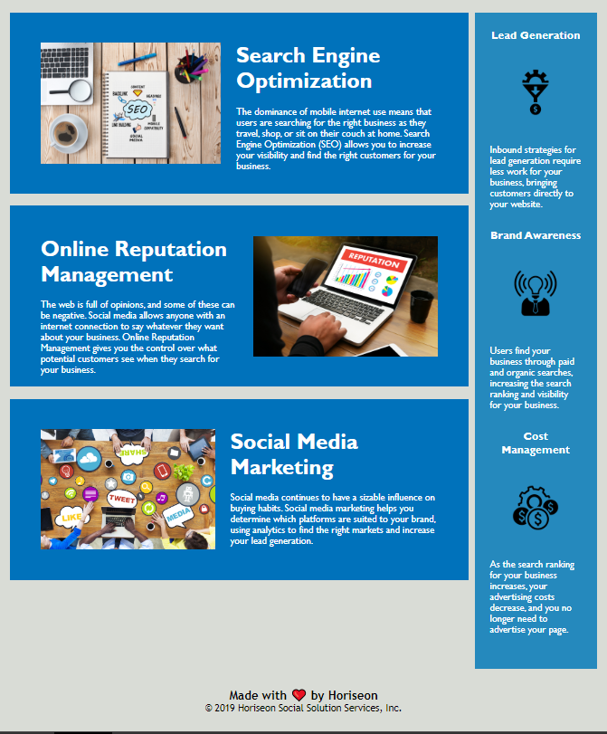

# Refactor of Horiseon webpage to meet accessibility standards
info: webpage has been refactored to meet general seo standards. 
what was done?: semantic html elements replaced most div elements.
                alt attributes added for images.
                title element replaced.
                headings fall in sequential order. (confirmed with original code)
                html in logical structure.
                css has been consolidated, deleted duplicate code. 
                css has been labeled. 
                internal nav link has been added for "search engine optimization"

git hub:<git@github.com:Walker-Walker/challenge-1.git>

git hub repo link: https://github.com/Walker-Walker/challenge-1.git

link: https://walker-walker.github.io/challenge-1/#social-media-marketing

screenshot:

